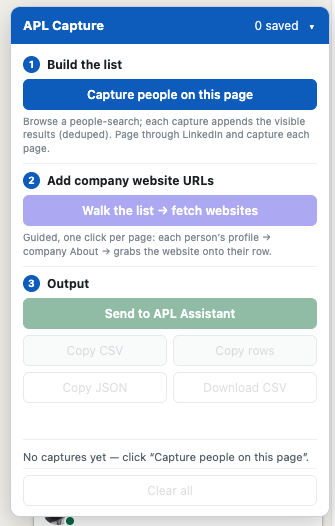
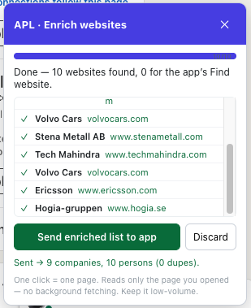
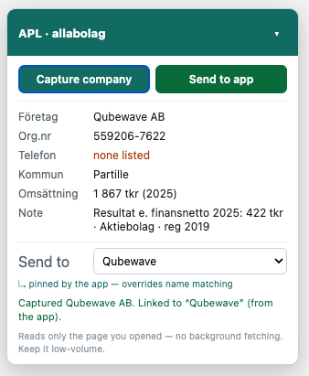

# APL Search Assistant

A **local-first** web app + browser extension that automates the grindy parts of the Lexicon ×
LTU **APL (internship) search** — discovery, enrichment, personalized outreach, and the required
≥15-host contact list — while keeping a human on every send button.

> Built for the Lexicon LTU VT-2026 APL search, and as a portfolio piece in the course stack
> (ASP.NET Core + EF Core/SQLite + React + a Chrome MV3 extension).


## What it does

**Company pipeline.** One table of every company with its stage
(`Identified → Enriched → Ready → Contacted → Replied → Closed`), email/phone channels,
enrichment status, and a **“≥15 ready” counter** that only counts companies with *both* a real
email and phone (the Lexicon-list bar). Filter by stage / ready-only, edit any field inline, add
companies by hand, expand a row for the full profile.

**Browser extension (Chrome MV3).** Assisted, manual, low-volume capture — no auto-crawling:

- **LinkedIn people-search capture** — browse a Boolean search yourself and append the visible
  results to a list (deduped, accumulates across pages).
- **Guided website-enrichment wizard** — one click per page walks each person’s profile →
  company About page → grabs the company website onto their row, then sends the enriched list to
  the app.
- **allabolag.se capture** — reads org.nr, switchboard phone, kommun, and revenue/financials from
  the page you opened and applies them to the right app company (pinned by the app via a link, so
  a name mismatch like *Euroclear* vs *Euroclear Sweden AB* still lands correctly).

<p>
  
  
  
</p>

**Enrichment.** Cautious, polite public-website fetch (homepage + likely contact/team pages —
`/kontakt`, `/om-oss`, `/team`, `/medarbetare`, …) that extracts emails/phones and attributes
them to people by name; a **per-person search fallback** to fill an individual email gap the crawl
missed; optional **website / LinkedIn-page lookup** via a configurable search provider
(Brave / Google PSE / Serper); and MX-gated generic guesses (`info@`, `kontakt@`) that are clearly
flagged and **excluded from the ≥15 list**. Every fetch failure degrades gracefully to manual entry.

**Contacts as reach-out points.** Every email, phone, and LinkedIn profile is a *trackable*
contact point with its own status (`Not contacted → Contacted → Replied → Bounced → Closed`),
grouped under the person it belongs to or the company.

**Personalized outreach — three channels, no auto-send.** Five editable templates (cold email,
LinkedIn inMail, phone script, follow-up, Lexicon cover) with `{{merge_field}}` tokens filled from
your details + the company. Per-company drafts you act on yourself:

- **Email** → opens a prefilled compose window (`mailto:` or *Open in Gmail*).
- **LinkedIn** → copies the inMail text to send manually.
- **Phone** → shows the merge-filled call script + a `tel:` link, log the outcome.

Marking one sent/logged **advances the company stage** and is recorded in an **Outbox**.

**Lexicon ≥15-list submission.** Generates the contact list (clean CSV + a cover email from the
Lexicon template), then a guided flow — *download CSV → open the email + attach it → mark
submitted* — and snapshots exactly what was sent for your records.

## How it flows

```
LinkedIn search ──(extension)──▶ capture people ──▶ wizard grabs websites ──▶ send to app
allabolag ───────(extension)──▶ org.nr / phone / financials ─────────────────▶ app
app ──▶ enrich (website crawl + search) ──▶ contacts ──▶ outreach (email/LinkedIn/phone)
    └──▶ when ≥15 are ready ──▶ generate + submit the Lexicon list
```

## Tech stack

- **Backend:** ASP.NET Core Minimal APIs (.NET 10), EF Core + **SQLite** (`apl.db`), code-first
  migrations applied on startup.
- **Frontend:** React 18 + Vite + TypeScript + Tailwind CSS v4.
- **Extension:** Chrome Manifest V3 content scripts (LinkedIn + allabolag), semantic-anchor DOM
  parsing, shared pure-JS parser with a Node test suite.

## Setup

**Prerequisites:** [.NET 10 SDK](https://dotnet.microsoft.com/download), Node.js 20+, and a
Chromium-based browser for the extension.

**1 · API** (creates + migrates `apl.db`, seeds the templates on first run):

```bash
cd app/Api
dotnet run          # → http://localhost:5099
```

**2 · Web app** (Vite dev server, proxies `/api` → :5099):

```bash
cd app/web
npm install
npm run dev         # → http://localhost:5180
```

**3 · Extension** — open `chrome://extensions`, enable **Developer mode**, click **Load
unpacked**, and select the `extension/` folder. It activates on LinkedIn search/profile/company
pages and on `allabolag.se`, and talks to the API on `localhost:5099`.

**4 · Settings (optional, in-app):** open **Settings** in the web app to
- pick a **search provider + API key** (Brave / Google PSE / Serper) for *Find website* and the
  per-person contact-gap search, and
- fill **Your details** (name, period, email, phone, LinkedIn, area, CV summary) — these feed the
  `{{your_*}}` / `{{period}}` outreach merge fields.

**Tests** (extension parser):

```bash
cd extension && npm install && npm test
```

## Project layout

```
app/Api/         ASP.NET Core API — entities, EF migrations, endpoints, services
app/web/         React + Vite frontend
extension/       Chrome MV3 extension (parser.js is shared + unit-tested)
Deliverable/     Manual fast-path templates (the M0 deliverable, with placeholders)
Docs/            PRD, enrichment-wizard spec, screenshots
```

## Privacy, security & ToS

- **Local-first:** all data lives in `apl.db` on your machine. The DB, `Deliverable.local/`,
  `Material/`, and `.env*` are git-ignored — the repo ships **schema + templates, never data**.
- **Secrets** (search API keys) and your outreach details are stored only in the local DB and are
  never returned to the browser in full or committed. No telemetry, no third-party trackers, no
  plus-alias in outbound mail.
- **Email is never auto-sent** — every message is reviewed and sent by you (mailto/Gmail compose).
- **Extension posture:** manual, user-initiated, read-only, one click = one navigation; it only
  reads the page you opened (no background fetching or auto-pagination), to stay within site terms.

## Status

Implemented through **M5**:

| | Milestone | State |
|---|---|---|
| M0 | Manual fast-path templates (`Deliverable/`) | ✅ |
| M1 | Company-centric data layer + pipeline | ✅ |
| M2 | Discovery (LinkedIn + allabolag capture) | ✅ |
| M3 | Enrichment (website crawl + search + allabolag) | ✅ |
| M4 | Templates + 3-channel outreach + Outbox | ✅ |
| M5 | Lexicon ≥15-list submission | ✅ |
| M6 | Reply tracking + follow-up-due queue + placement | ⬜ |
| M7 | Stretch — LLM interview prep, auto inbox-read, bookmarklet | ⬜ |

## Docs

- **[Product Requirements (PRD)](Docs/APL_Search_Assistant_PRD.md)** — full spec, data model,
  build milestones.
- **[Enrichment wizard spec](Docs/enrichment-wizard.md)** — the guided LinkedIn → website flow.
- **`Deliverable/`** — the manual fast-path templates (spontansök email, LinkedIn inMail, phone
  script, Lexicon cover + list).
